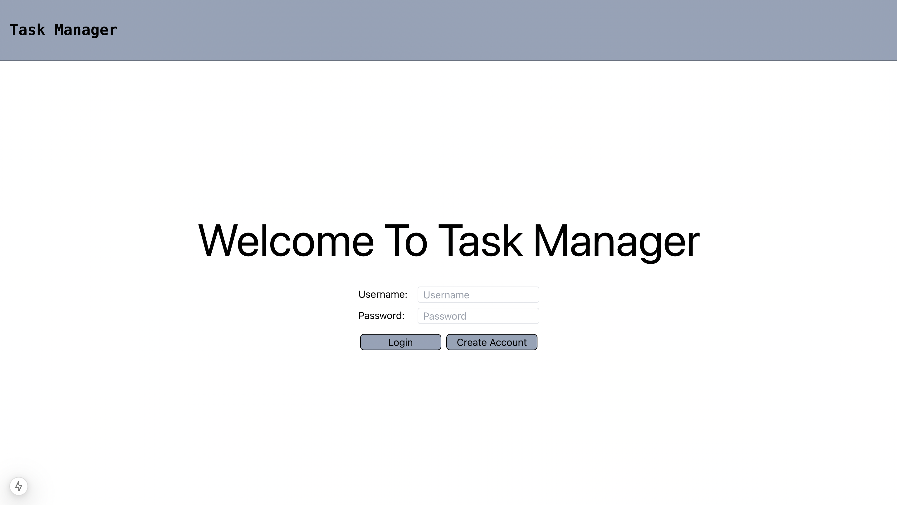
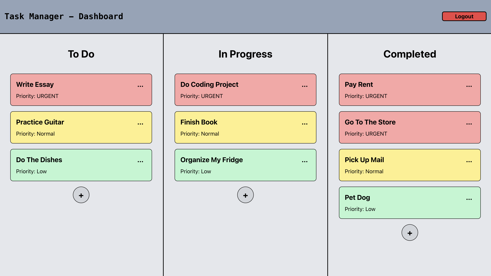

# TaskManager

#### Task Manager is an app that lets you create, edit, and prioritize tasks!

#### Task Manager includes features such as priority to help put your most urgent tasks first

#### Task Manager also lets users drag and drop tasks between columns to change a task's status from To Do -> In Progress -> Complete

#### Users are free to Edit or Delete tasks if needed

|  |  |
| ------------------------------------------- | ------------------------------------------- |

# Installation Instructions 

## 1. Clone the repository
Navigate to your prefered directory and clone the repository
```
git clone 'insert URL here'
```
Navigate to the cloned repo
```
cd TaskManager
```
## 2. Set Your Environment Variables

Copy the `.env.example` file and rename it to `.env`
```
cp .env.example .env
```

Set your `DATABASE_URL` in the .env file. 

If desired, you can change the value to your prefered filepath 

```
DATABASE_URL=sqlite:///./app/taskmanager.db
```

Generate a secret key using the following command
```
python3 -c "import secrets; print(secrets.token_hex(32))"
```
Once generated, replace value of `SECRET_KEY` in `.env` file
```
SECRET_KEY=yourSecretKeyHere
```

## 2. Install Python Dependencies
All required python dependencies are included in the requirements.txt file located in the backend directory.
```
cd backend
pip3 install -r requirements.txt
```
## 3. Create SQLite Database
From `backend` directory run the `create_db.py` script. This will set up your database in SQLite and initialize your tables. 
```
python3 -m app.create_db
```
## 4. Run the Python Server
Run the FastAPI server using the following command from the `backend` directory:

```
python3 -m uvicorn app.main:app --reload
```

Note, you will have to run the app on `port 8000`. This is the default so no changes should be needed after starting the serer. 

Do Not close the python terminal. You need to leave the python server running for the app to work

## 3. Install React Dependencies
Open a new terminal

Navigate to the `react-app` directory and install required dependencies
```
cd frontend/react-app
npm install
```

## 5. Run the React Server
Run the React NextJS server using the following command from the backend directory:

```
npm run dev
```
Note, you will have to run the react portion of the app on `port 3000`. This is the default so no changes should be needed.

Do Not close the terminal. You need to leave the NextJS server running for the app to work.

## 6. Viewing the Site
Visit the following site on any browser (chrome preferred)
```
http://localhost:3000/
```

**You should now be able to start enjoying Task Manager!!**
